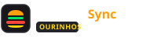
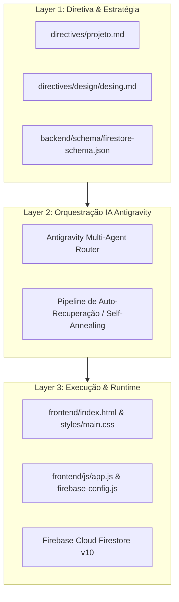

<div align="center">

# 🍔 BurguerSync Ourinhos
### *Real-Time Food Delivery & Kitchen Display System (KDS)*
### *Plataforma de Delivery em Tempo Real e Painel KDS de Cozinha*

[](https://deepmind.google/)
[](https://stitch.googleapis.com)
[](https://firebase.google.com/)
[](https://nodejs.org)
[](LICENSE)

<br/>



<p align="center">
  <strong>Desenvolvido e Orquestrado com Google Antigravity &bull; SENAI Ourinhos Edition</strong>
</p>

[🇧🇷 Português](#-sobre-o-projeto-pt-br) &bull; [🇺🇸 English](#-about-the-project-en-us)

---

</div>

## 🇧🇷 Sobre o Projeto (PT-BR)

O **BurguerSync Ourinhos** é uma plataforma web full-stack desenvolvida para revolucionar a operação de delivery de alimentação e o autoatendimento gastronômico na região de Ourinhos/SP. Inspirado em experiências de alta conversão como iFood e sistemas industriais de cozinha (KDS - Kitchen Display System), o sistema elimina ruídos de comunicação e comandas manuais de papel através de sincronização bidirecional e instantânea via **Google Firebase Cloud Firestore**.

### 🌟 Destaques Tecnológicos
- **Google Antigravity (IA Generativa & Agente Orquestrador):** Concepção arquitetural, especificação técnica, validação de regras de negócio e geração automatizada de código em 3 camadas desacopladas.
- **Google Stitch Integration:** Prototipação visual em alta fidelidade com geração de temas neon, tokens de design e assets visuais de produtos.
- **Google Firebase Firestore v10:** Persistência em tempo real com WebSockets (`onSnapshot`), persistência offline (`IndexedDB`) e resiliência com arquitetura *Self-Annealing*.
- **Experiência Mobile-First SPA:** Alternância instantânea sem recarregar a página entre a **Visão do Cliente** (cardápio, observações, carrinho deslizante e checkout) e a **Visão da Cozinha** (comandas de chapa, métricas em tempo real e atualização de status em 1 clique).

---

## 🇺🇸 About the Project (EN-US)

**BurguerSync Ourinhos** is a full-stack real-time food delivery and Kitchen Display System (KDS) web application crafted for the Ourinhos/SP market. Built with modern web standards and reactive cloud architecture, it eliminates the operational gap between customer checkout and kitchen food preparation.

### 🌟 Technological Highlights
- **Google Antigravity Powered:** AI orchestration and multi-agent coordination following the strict 3-Layer Architecture (Directives, Orchestration, Execution).
- **Google Stitch Integration:** High-fidelity interactive design prototyping, dark neon color palette tokens, and gourmet visual assets.
- **Google Firebase Cloud Firestore v10:** Real-time synchronization via listeners, instant status mutations, and offline cache resilience.
- **Mobile-First SPA:** Seamless client ordering experience paired with a high-throughput kitchen display panel.

---

## 🏗️ Arquitetura em 3 Camadas (3-Layer Architecture)



---

## 🤖 Agentes e Skills do Google Antigravity Utilizados

Durante todo o ciclo de desenvolvimento, o ecossistema do **Google Antigravity** foi empregado através de agentes especializados e skill packs:

| Agente / Skill Pack | Finalidade no Projeto |
| :--- | :--- |
| **`@agente-orquestrador`** | Coordenação determinística das 3 camadas, auto-recuperação e fluxo de build. |
| **`@app-builder`** | Estruturação de componentes front-end e sincronização de dados. |
| **`@frontend-design`** | Aplicação estrita dos tokens de design neon do Google Stitch. |
| **`@database-design`** | Modelagem NoSQL no Firebase Cloud Firestore e regras de segurança. |
| **`@clean-code`** | Implementação de código limpo, sem dependências infladas e de alto desempenho. |

---

## 🚀 Como Executar Localmente / Quickstart

### No Windows:
Basta executar o script automatizado `executar.bat`:
```cmd
.\executar.bat
```

### Via Terminal Node.js:
```bash
# Iniciar o servidor HTTP local na porta 3000
node execution/server.mjs

# Abrir no navegador:
http://localhost:3000/frontend/index.html
```

---

## 📱 Fluxo de Status do Pedido (KDS Lifecycle)

```
[🛒 Cliente Envia Pedido] 
       │
       ▼
 [🟡 Recebido (Pendente)] ──► Notifica KDS da Cozinha
       │
       ▼ (1 Clique)
 [🔵 Na Chapa (Em Preparo)] ──► Chapeiros iniciam preparo dos smashs
       │
       ▼ (1 Clique)
 [🟠 Saiu p/ Entrega] ──► Notifica expedição e motoboys
       │
       ▼ (1 Clique)
 [🟢 Entregue] ──► Concluído e arquivado
```

---

## 📄 Licença
Distribuído sob a licença MIT. Consulte `LICENSE` para mais informações.

*Desenvolvido com ⚡ Google Antigravity por Aluno SENAI Ourinhos.*
